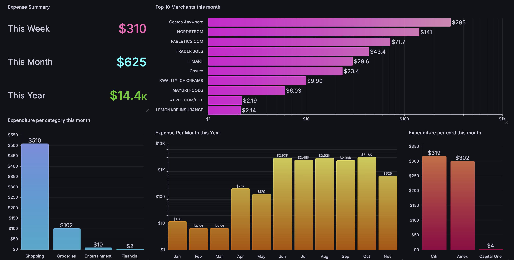

# xpenz


**xpenz** is a Python-based personal finance automation tool that reads your bank transaction alert emails, extracts key details using a local LLM (via [Ollama](https://ollama.com/)), stores them in a PostgreSQL database, and categorizes merchants — all automatically.

No manual data entry. No paid services. Runs entirely on your own infrastructure.

---

## How It Works

```
Gmail (IMAP)
    │
    ▼
fetch.py  ──► Parses email subject + body
    │
    ▼
llama.py  ──► Sends to Ollama (llama3) → returns { amount, merchant, type }
    │
    ▼
db.py     ──► Inserts into PostgreSQL `txn` table
    │
    ▼
categorize.py ──► Finds uncategorized merchants in `txn`
    │
    ▼
llama.py  ──► Sends merchant name → returns { refined_name, category }
    │
    ▼
db.py     ──► Inserts into PostgreSQL `merch_cat` table
```

The two pipelines run on a schedule via Apache Airflow DAGs:
- **ETL DAG** (`xpenz_etl_bash_dag`): runs `main.py` daily at **midnight**
- **Categorize DAG** (`xpenz_categorize_dag`): runs `categorize.py` daily at **12:30 AM**

---

## Project Structure

```
xpenz/
├── dag/
│   ├── xpenz_etl_dag.py          # Airflow DAG: fetch + store transactions
│   └── xpenz_categorize_dag.py   # Airflow DAG: categorize merchants
├── main.py                        # Entry point: orchestrates fetch → store
├── fetch.py                       # Gmail IMAP client + email parser + LLM caller
├── llama.py                       # HTTP client for Ollama API
├── categorize.py                  # Merchant categorization pipeline
├── db.py                          # PostgreSQL connection + query helpers
├── config_loader.py               # Loads and exposes all config from config.json
├── requirements.txt               # Python dependencies
├── config.json                    # Your credentials + config (gitignored)
└── README.md
```

---

## Database Schema

### `txn` — Transaction records

| Column     | Type      | Description                        |
|------------|-----------|------------------------------------|
| `datetime` | timestamp | Transaction date and time          |
| `card`     | text      | Card name (e.g. "Chase", "Amex")   |
| `merchant` | text      | Raw merchant name from email       |
| `amount`   | numeric   | Transaction amount                 |
| `type`     | text      | `debit` or `credit`                |

Duplicate transactions are ignored via a `unique_txn_record` constraint.

### `merch_cat` — Merchant categories

| Column     | Type | Description                              |
|------------|------|------------------------------------------|
| `merchant` | text | Raw merchant name (primary key)          |
| `company`  | text | Refined company name (e.g. "Amazon")     |
| `category` | text | Spending category (e.g. "Shopping")      |

---

## Prerequisites

- Python 3.9+
- A running **PostgreSQL** instance
- A running **Ollama** instance with the `llama3` model pulled
  ```sh
  ollama pull llama3
  ```
- A **Gmail App Password** — [how to create one](https://support.google.com/accounts/answer/185833)
- (Optional) **Apache Airflow** for scheduled automation

---

## Setup

### 1. Clone and install

```sh
git clone https://github.com/aadityaanaik/xpenz.git
cd xpenz

python3 -m venv venv
source venv/bin/activate        # macOS/Linux
# .\venv\Scripts\activate       # Windows

pip install -r requirements.txt
```

### 2. Create `config.json`

Create a `config.json` file in the project root using the template below:

```json
{
    "EMAIL_CONFIG": {
        "EMAIL": "your-email@gmail.com",
        "EMAIL_PASS": "your-google-app-password",
        "SENDER": {
            "capitalone@notification.capitalone.com": {
                "card": "Capital One",
                "subject": "A new transaction was charged to your account"
            },
            "alerts@info6.citi.com": {
                "card": "Citi",
                "subject": "transaction was made on your Costco Anywhere account"
            },
            "americanexpress@welcome.americanexpress.com": {
                "card": "Amex",
                "subject": "Large Purchase Approved"
            },
            "no.reply.alerts@chase.com": {
                "card": "Chase",
                "subject": "transaction with"
            }
        }
    },
    "DB_CONFIG": {
        "DBNAME": "xpenz",
        "DBUSER": "your_db_user",
        "DBPASS": "your_db_password",
        "DBHOST": "your_db_host_ip",
        "DBPORT": "5432"
    },
    "LLAMA_CONFIG": {
        "LLAMA_PORT": "11434",
        "LLAMA_HOST": "your_llama_host_ip"
    },
    "QUERY_CONFIG": {
        "INSERT_TXN": "INSERT INTO txn (datetime, card, merchant, amount, type) VALUES (%(datetime)s, %(card)s, %(merchant)s, %(amount)s, %(type)s) ON CONFLICT ON CONSTRAINT unique_txn_record DO NOTHING",
        "INSERT_MERCH_CAT": "INSERT INTO merch_cat (merchant, company, category) VALUES (%s, %s, %s) ON CONFLICT (merchant) DO NOTHING;",
        "SELECT_DISTINCT_MERCH_TXN": "SELECT DISTINCT merchant FROM txn",
        "SELECT_DISTINCT_MERCH_TXN_DATE": "SELECT DISTINCT merchant FROM txn WHERE datetime >= {since_date}",
        "SELECT_EXISTING_MERCH_CAT": "SELECT distinct merchant FROM merch_cat",
        "SELECT_LATEST_DATE": "SELECT DATE(MAX(datetime)) FROM txn"
    },
    "PROMPT_CONFIG": {
        "EMAIL_INFO": "You are an automated financial data extraction API. Your sole purpose is to analyze the subject and body of a financial email and extract key details into a structured JSON format... [SUBJECT]: {email_subject}\\n[BODY]: {email_body}\\n---END DATA---",
        "MERCH_CATEGORY_INFO": "Return ONLY one JSON object with structure ... Now, process this merchant: {merchant}"
    }
}
```

### Configuration Reference

| Section | Key | Description |
|---|---|---|
| `EMAIL_CONFIG` | `EMAIL` | Your Gmail address |
| `EMAIL_CONFIG` | `EMAIL_PASS` | Google App Password (not your regular password) |
| `EMAIL_CONFIG` | `SENDER` | Map of sender email → `{ card, subject }`. The `subject` value is a substring to match against email subjects. Add or remove entries to support different banks. |
| `DB_CONFIG` | `DBNAME/USER/PASS/HOST/PORT` | PostgreSQL connection details |
| `LLAMA_CONFIG` | `LLAMA_HOST/PORT` | Host and port of your running Ollama instance (default port: `11434`) |
| `QUERY_CONFIG` | — | SQL queries used by the app. Only change these if you modify the database schema. |
| `PROMPT_CONFIG` | `EMAIL_INFO` | Prompt sent to the LLM to extract `amount`, `merchant`, and `type` from an email |
| `PROMPT_CONFIG` | `MERCH_CATEGORY_INFO` | Prompt sent to the LLM to refine a raw merchant name and assign a spending category |

---

## Running

### Manually

Fetch new transactions and store them:
```sh
python main.py
```

Categorize any uncategorized merchants:
```sh
python categorize.py
```

### With Apache Airflow

Copy the DAG files to your Airflow DAGs folder:
```sh
cp dag/*.py $AIRFLOW_HOME/dags/
```

Update the `bash_command` paths in both DAG files to match your environment:
```python
bash_command='cd /path/to/xpenz && /path/to/python3 main.py'
```

The two DAGs will then appear in the Airflow UI:

| DAG ID | Schedule | Task |
|---|---|---|
| `xpenz_etl_bash_dag` | `0 0 * * *` (midnight) | Runs `main.py` |
| `xpenz_categorize_dag` | `30 0 * * *` (12:30 AM) | Runs `categorize.py` |

Both DAGs have 1 automatic retry with a 5-minute delay on failure.

---

## Adding a New Bank

To add support for a new bank's transaction emails:

1. Find the sender email address and a unique substring from the subject line of their transaction alerts.
2. Add an entry to `SENDER` in `config.json`:
   ```json
   "alerts@yourbank.com": {
       "card": "Your Bank",
       "subject": "unique subject substring"
   }
   ```
3. If the email format is unusual, you may need to tune the `EMAIL_INFO` prompt in `PROMPT_CONFIG` to help the LLM extract data correctly.

---

## Contributing

Contributions are welcome. To contribute:

1. Fork the repository
2. Create a feature branch: `git checkout -b feature/your-feature`
3. Commit your changes: `git commit -m 'Add your feature'`
4. Push to the branch: `git push origin feature/your-feature`
5. Open a Pull Request

---

## License

MIT License — see [LICENSE](LICENSE) for details.
